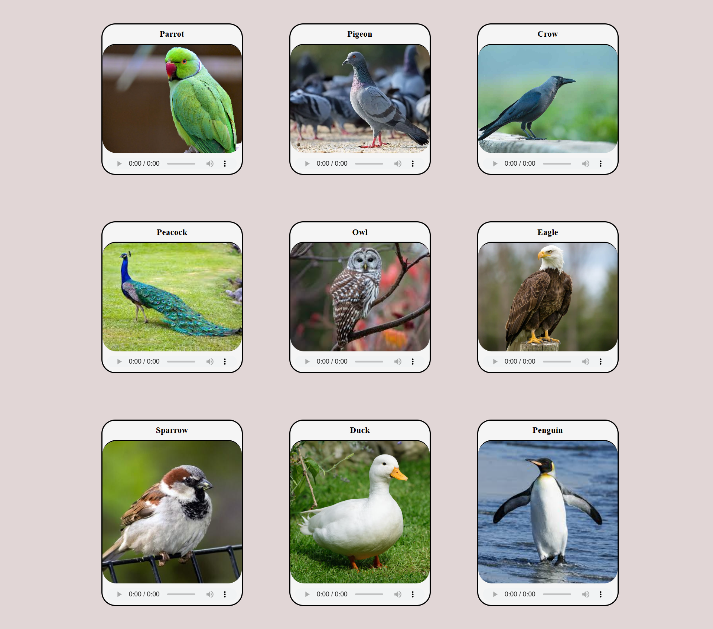
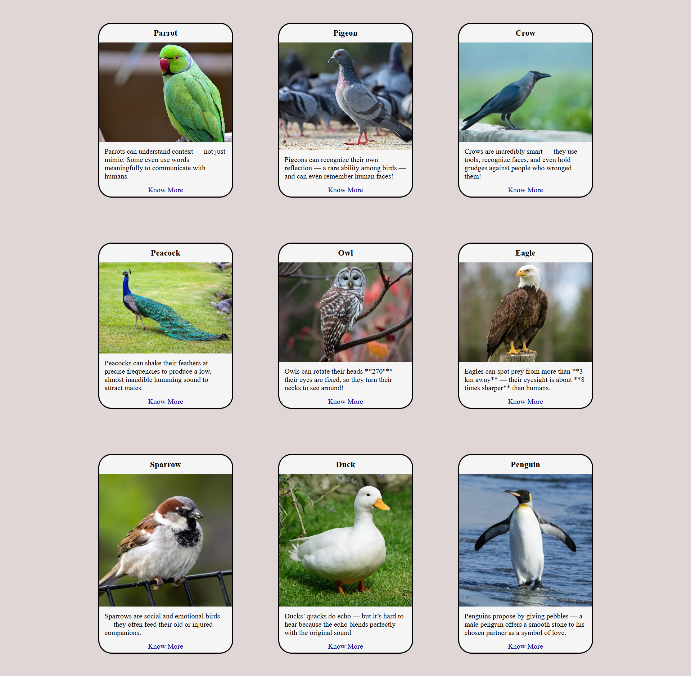
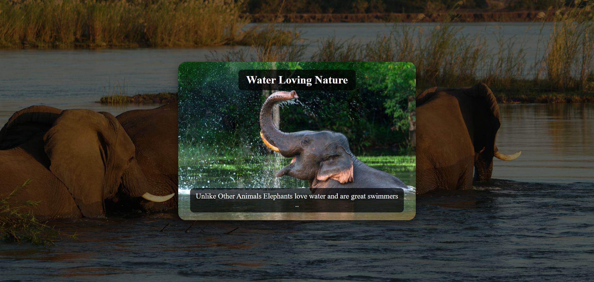
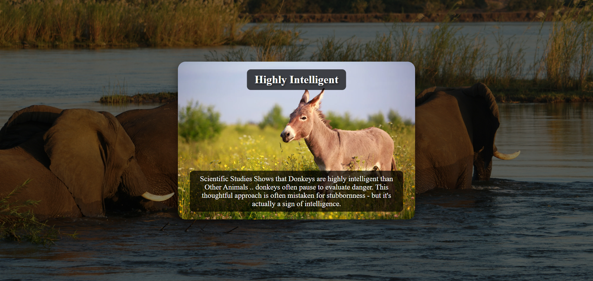
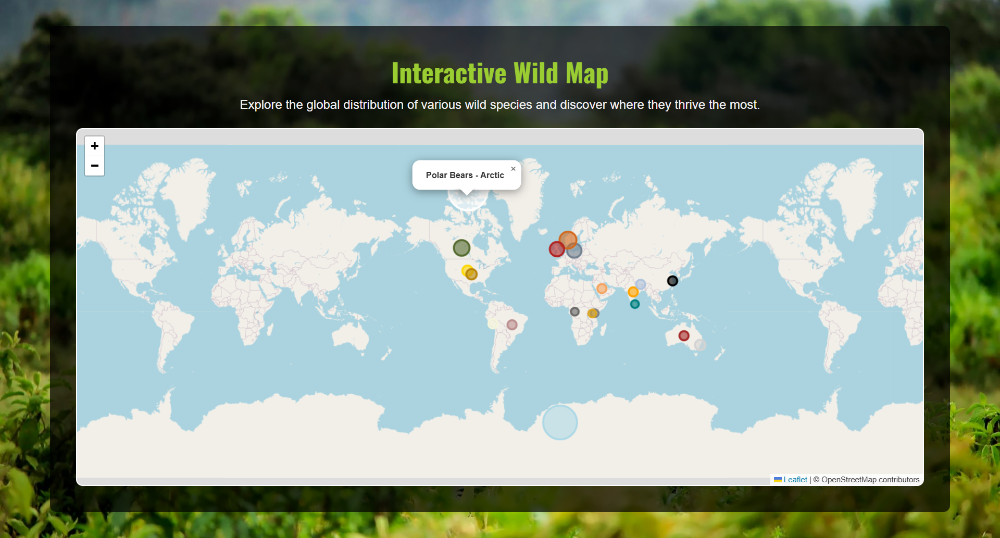
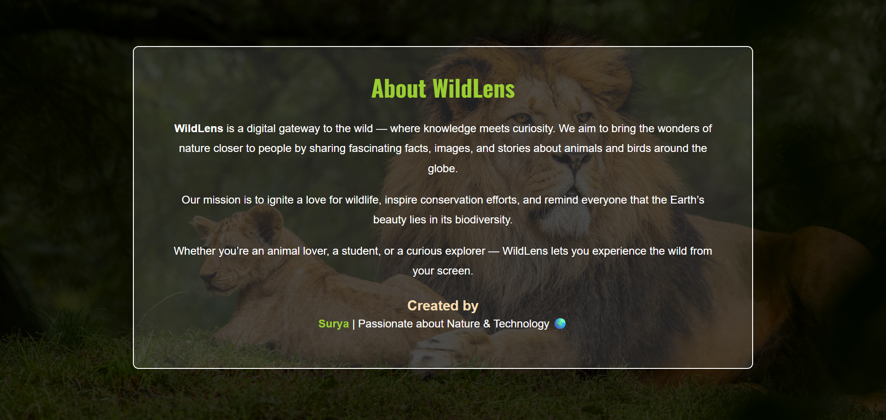

# WildLens – An Interactive Wildlife Awareness Platform

WildLens is a web-based platform designed to promote wildlife awareness, education, and conservation through an immersive digital experience.
Built using HTML, CSS, JavaScript.. The project showcases animals and birds through images, sounds, facts, conservation challenges, and an interactive map that highlights species distribution.

# View My Site
   [Surya's Pencil](https://surya-arun.github.io/WildLens/)
   
## Features
### 1. Wild Gallery

Browse images of animals and birds

Listen to species-specific sounds

Clean card-based UI for quick exploration

### 2. Explore Facts

Displays one key fact for each species in a card format

“Know More” button redirects to a dedicated details page

Additional facts are presented in an easy-to-read layout

### 3. Conservation Challenges

Highlights major threats faced by wildlife

Educates users on environmental and conservation issues

### 4. Wild Map

Displays dense habitat regions of species

Provides geographical insights into wildlife distribution

Built using map-based visualization concepts

## Objective

WildLens aims to:

* Raise awareness about wildlife

* Provide an educational and engaging experience

* Showcase conservation issues in a simple, accessible format

* Demonstrate how modern web technologies can be used for environmental awareness

## Tech Stack
### Frontend
* HTML
* CSS
* JavaScript

## How to Run Locally
* ### Clone the repository
    git clone https://github.com/your-username/WildLens.git

* ### Open Home
Right click on home.html and open with live server

* ### The app will run at:
👉 http://localhost:3000/

## Screenshots 

### Home Page 

### Animal Gallery Page

### Bird Facts Page

### Animal Facts Page

### Bird Facts Page

### Elephant Facts Page

### Donkey Facts Page

### Map Page

### About Page

## Future Enhancements

* AI-based species identification from uploaded images

* Interactive quizzes for engagement

* Additional species database (marine life, insects, plants)

* Real-time conservation news integration

* Dark mode support

## Contributing

Contributions, issues, and feature requests are welcome!
Feel free to open a pull request or raise an issue.

## License

This project is created for academic and educational purposes.
You may reuse or modify the code with proper credit.

##  Author

### Surya
FullStack Developer | Wildlife Enthusiast

### Check out Live version at

    https://surya-arun.github.io/WildLens/
